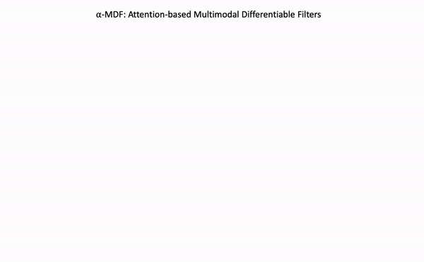

# $\alpha$-MDF: An Attention-based Multimodal Differentiable Filter for Robot State Estimation

<p align="center">

</p>

Differentiable Filters are recursive Bayesian estimators that derive the state transition and measurement models from data alone. Their data-driven nature eschews the need for explicit analytical models, while remaining algorithmic components of the filtering process intact. As a result, the gain mechanism -- a critical component of the filtering process -- remains non-differentiable and cannot be adjusted to the specific nature of the task or context. In this paper, we propose an attention-based Multimodal Differentiable Filter ($\alpha$-MDF) which utilizes modern attention mechanisms to learn multimodal latent representations. Unlike previous differentiable filter frameworks, $\alpha$-MDF substitutes the traditional gain, e.g., the Kalman gain, with a neural attention mechanism. The approach generates specialized, context-dependent gains that can effectively combine multiple input modalities and observed variables. We validate $\alpha$-MDF on a diverse set of robot state estimation tasks in real world and simulation. Our results show $\alpha$-MDF achieves significant reductions in state estimation errors, demonstrating nearly 4-fold improvements compared to state-of-the-art sensor fusion strategies for rigid body robots. Additionally, the $\alpha$-MDF consistently outperforms differentiable filter baselines by up to 45% in soft robotics tasks.


## Getting Started
#### docker workflow

Clone the repo `git clone https://github.com/...`

#### Set the environment variables
Edit the `conf.sh` file to set the environment variables used to start the docker 
containers. 

```
IMAGE_TAG=  # unique tag to be used for the docker image.
CONTAINER_NAME=UR5-task-1  # name of the docker container.
DATASET_PATH=/home/datasets/  # Dataset path on the host machine.
CUDA_VISIBLE_DEVICES=0  # comma-separated list of GPU's to set visible.
```

#### Build the docker image
Run `./build.sh`

## Project Structure

#### Training or testing
Create or a modify a yaml file found in `./config` 
with the appropriate parameters. Set the mode parameter to perform the 
training or testing routine. 

```
mode:
    mode: 'train'  # 'train' | 'test'
```

Run the training and test script using the bash file `./run_filter.sh $CONFIG_FILE` 
where `$CONFIG_FILE` is the path to the config file. e.g. 
`./run_filter.sh ./config/latent_UR5.yaml`

View the logs with `docker logs -f $CONTAINER_NAME`

#### Tensorboard

Use the docker logs to copy the tensorboard link to a browser

```docker logs -f $CONTAINER_NAME-tensorboard```
 
#### Without Docker

If you don't want to use the docker container for training, you may directly use the
`train.py` script and pass in the config file. Make sure to have corresponding libraries and
dependencies installed on your local machine. Plase refer to `requirement.txt` and `Dockerfile` 
for those required packages.

Go to `./latent_space` and then

Run `python train.py --config ./config/latent_UR5.yaml`


## Models
### $\alpha$-MDF
attention-based Multimodal Differentiable Filters


## Datasets
#### KITTI_dataset
https://www.cvlibs.net/datasets/kitti/eval_odometry.php
#### UR5_dataset
Access to the dataset is available upon request.
#### Tensegrity_dataset
Access to the dataset is available upon request.

## Results
TBD

## Model Zoo
TBD

